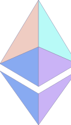

# protoSvgLib

## Purpose
ProtoSvgLib provides the first onchain SVG tool. It provides some primitives which helps to reduce the gas fees for who wants to deploy a smart contract generating SVG. The storage size is also lowered since the data are encoded.

Warning: this contract is a Proof of Concept.

## Usage
In order to define a triangle and apply some style to it:  
`svgContract.triangle(hex"fafe01404e4000006a");`  
will return `"<polygon class='c250' points='64 78 64 0 0 106' />"`  
Parameters:
| Pos | Ex. Value | Meaning       | Note                      |
|----:|-----------|---------------|---------------------------------------------------------|
| 0   | fa        | id="i250"     | Bugged, and makes the SVG unparsable. Use 00 to disable |
| 1   | fe        | class="c254"  |                                                         |
| 2   | 01        | ending '>'    | if 0 ends with '/>'                                     | 
| 3,4 | 404e      | 1st point, xy |                                                         |
| 5,6 | 4000      | 2nd point, xy |                                                         |
| 7,8 | 006a      | 3rd point, xy |                                                         |

`svgContract.styleColor(".c250", hex"cab3f6ff");`  
will return `""`  
Parameters:  
`string _element` should contain `class='cxxx'` or `id=ixxx`
| Pos | Ex. Value | Meaning          |
|----:|-----------|------------------|
| 0   | ca        | Red, here 239    |
| 1   | b3        | Green, here 204  |
| 2   | f6        | Blue,            |
| 3   | ff        | Alpha (Opacity)  |

[Deployed contract](https://etherscan.io/address/0xfcd62e3c95a351493e1b7d9e8cdf1ee10d54feb6)

## Tools
Display and verify the tokenURI data with [tokenURItoSVG.py](scripts/tokenURItoSVG.py). Useful when integrated in Brownie scripts.

## Roadmap
 - Add some common shapes and other elements. Then publish a more complete and tested one.
 - Define an extensible proxy contract

## Example Support the Project
Based on this lib, EthSvgLogo is a collectible ERC721. Soon on opensea ( 0x52434Cd9e4e4F965a20c8576841CbAAC4b2bA30e ).

## Caveats
In order to reduce the storage size, the datas are expressed in uint8, so we cannot define floats for the coordinates.
This is my first smart contract deployed on mainnet. 
